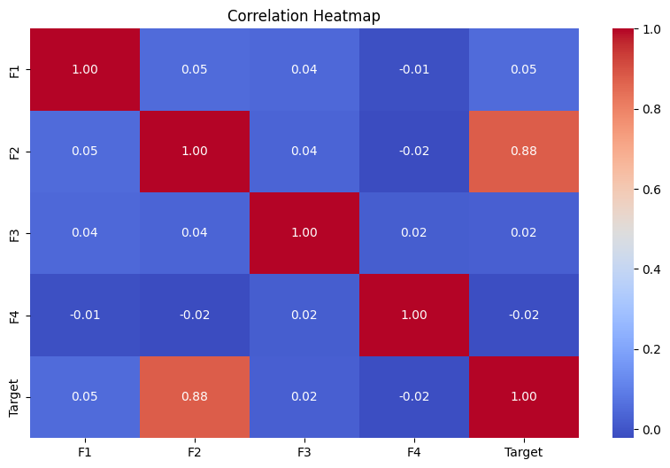
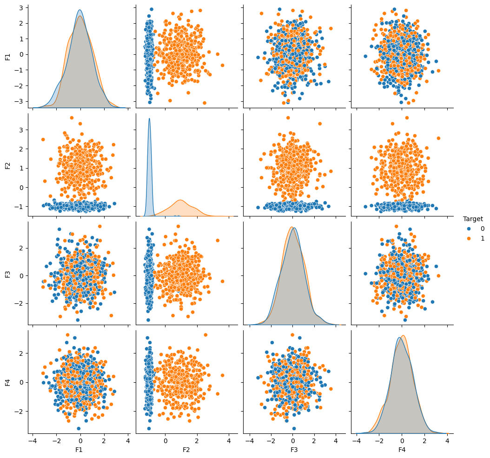
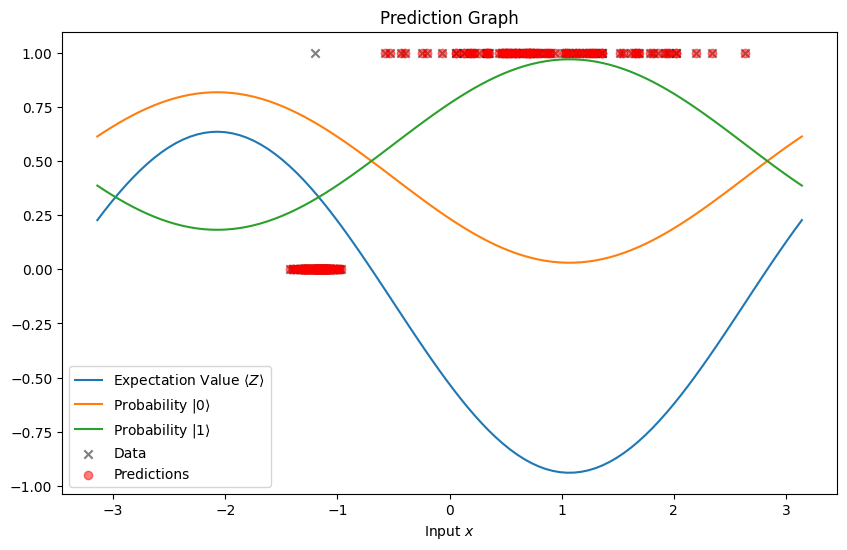

# QuantumChallenge
Reto para el Qiskit Fall Fest Latino, Escuela en Español de Computación Cuántica

### Reto: Decodificar y Clasificar

Este proyecto se enfoca en codificar los archivos [challenge_train.csv](https://github.com/QuantumQuipu/QuantumChallenge/blob/main/challenge_train.csv) y [challenge_test.csv](https://github.com/QuantumQuipu/QuantumChallenge/blob/main/challenge_test.csv) en al menos dos formas diferentes en un circuito cuántico (estas podrían ser codificaciones basadas en ángulos, amplitud, kernel, aleatorias o personalizadas).

---


# Solución
## Analisis de los datos

Los datos proporcionados para este problema constan de dos conjuntos de datos: uno de entrenamiento y otro de prueba. Ambos conjuntos están compuestos por 4 características y un objetivo. Las características son variables continuas, y el objetivo es una variable discreta que puede tomar dos valores, 0 o 1.

El tamaño de los conjuntos de datos es de 800 datos para el conjunto de entrenamiento y 200 para el conjunto de prueba.

Se analizaron los datos de entrenamiento y prueba para observar la distribución de los datos y la correlación entre las variables. Para este análisis, se presenta un mapa de calor de correlación entre las variables y cómo se distribuyen para encontrar posibles patrones que faciliten la clasificación.

### Correlación entre variables



### Distribución de los datos



Basándonos en estos resultados, es fácil observar que la característica 2 es la que presenta mayor correlación con el objetivo y que su distribución facilita la clasificación. Además, se puede concluir que no existe correlación en las demás características.

De esta manera, se siguieron dos métodos para el uso de los datos. El primero, y el más simple, consistió en descartar simplemente las características que no aportan información aparente para la clasificación. El segundo método consistió en utilizar la técnica de Análisis de Componentes Principales (PCA) para facilitar la clasificación.

Estas técnicas se utilizaron para la codificación de los datos en el circuito cuántico. La primera técnica se empleó con el primer método de codificación, mientras que la segunda técnica se utilizó con el segundo método de codificación.

## Método 1: Data Reuploading con Pennylane y PyTorch

**El notebook que contiene todos los resultados de este método se encuentra en el notebook [`Data_Reuploading_Results.ipynb`](Data_Reuploading_Results.ipynb).**

Para la clasificación de datos, se utilizó el algoritmo de Data Reuploading, que implica la repetición de capas $L(\theta_i, x)$, donde $\theta_i$ es un vector de parámetros y $x$ es el vector de características. Cada capa consta de un bloque de codificación $S(x)$ y un bloque de parámetros entrenables $W(\theta_i)$. Al final de varias capas, se añade un bloque adicional de entrenamiento para garantizar la alternancia entre un bloque de codificación y uno de entrenamiento.

$$L(\theta_i,x) = S(x) W(\theta_i)$$

La elección de este método se basa en resultados recientes, como los de Maria Schuld et al., 2021 [^1], y Adrián Pérez-Salinas et al., 2020 [^2]. En [^2], se demuestra que un solo qubit puede actuar como un clasificador universal con el número adecuado de capas y el observable correcto. Por otro lado, [^1] revela que Data Reuploading es un aproximador universal de funciones continuas, siempre que estas puedan aproximarse en series de Fourier. El número de frecuencias accesibles está limitado por el número de capas de codificación, y las amplitudes de las frecuencias están definidas por todo el circuito.

Basándonos en esto y considerando la simplicidad del problema, es factible concluir que el problema puede resolverse utilizando solo un qubit y una capa, resultados que se mostrarán a continuación.

[^1]: https://arxiv.org/abs/2008.08605
[^2]: https://arxiv.org/abs/1907.02085

### Resumen del Entrenamiento

Los datos utilizados para este método fueron normalizados para estar en el rango de valores de $-\pi$ a $\pi$. Además, se empleó únicamente la feature 2, como se mencionó anteriormente.

Se realizaron entrenamientos de varios circuitos utilizando PyTorch con el optimizador Adam. Se empleó un learning rate variable de 0.2 y un batch size de 100 durante 100 epochs. Se implementó una reducción del learning rate en un factor de 0.5 cada 10 epochs si el loss no mejoraba, deteniendo el entrenamiento después de 3 reducciones del learning rate sin mejora.

#### Función de Pérdida

Para establecer la función de costo, se definió un observable $O$ medible en el circuito, utilizando el proyector de los estados $\ket{0}$ y $\ket{1}$ para las etiquetas 0 y 1, respectivamente. La función de pérdida se diseñó para optimizar la fidelidad entre el estado resultante del circuito variacional y el estado objetivo. Se formuló como la media de la diferencia al cuadrado entre la fidelidad del estado objetivo y su valor máximo posible de 1.

$$Loss = \frac{1}{N} \sum_{i=1}^N (1 - \braket{\psi_i|\psi(x_i)})^2$$

Donde $\ket{\psi(x_i)}$ representa el estado resultante del circuito variacional y $\ket{\psi_i}$ es el estado objetivo.

El código completo utilizado para el entrenamiento se encuentra en el archivo `python_utils/data_reuploading_pennylane_pytorch.py`.

### Resultados

Se entrenaron 5 circuitos para comparar la calidad de la solución, la cantidad de recursos utilizados y cómo estos afectan a la solución. Los circuitos se diferencian en la cantidad de capas de codificación y la cantidad de qubits utilizados. Los resultados se almacenaron en la carpeta `best_params_pytorch/`.

Los resultados se muestran en la siguiente tabla:

| Circuito | Número de Qubits | Número de Layers | Número de Parámetros | Accuracy Train | Accuracy Test |
|----------|-------------------|-------------------|----------------------|-----------------|---------------|
| 1 | 1 | 1 | 6 | 0.9875 | 0.995 |
| 2 | 1 | 2 | 9 | 0.9925 | 0.995 |
| 3 | 1 | 3 | 12 | 0.9925 | 0.995 |
| 4 | 2 | 1 | 12 | 0.99 | 0.99 |
| 5 | 2 | 2 | 18 | 0.9925 | 0.995 |

El mejor circuito encontrado en términos de recursos cuánticos utilizados, es decir, el número de compuertas y qubits, es el Circuito 1. Utiliza un solo qubit y una sola capa de codificación. Este circuito logra una precisión del 0.995 en el conjunto de entrenamiento y del 0.9875 en el conjunto de prueba.

Sin embargo, es posible observar que el aumento de capas lleva a un aumento en la precisión de los datos de entrenamiento, pero no en los datos de prueba. Esto se debe a que el Circuito 1 ya ha alcanzado la máxima precisión posible para los datos de prueba, que es 0.995, es decir, un único valor mal clasificado.

Con estos resultados tambien es posible observar que se verifica los resultados de los papres [^1] y [^2], ya que se puede observar que con un solo qubit se puede resolver el problema de clasificacion como fue observado en [^2]. Ademas que la cantidad de frecuencias que es posible acceder esta limitada por la cantidad de capas de codificacion, como se observa en [^1].

Esto también se puede observar en el siguiente gráfico, que muestra el valor esperado del operador Pauli Z $\langle Z\rangle$ así como las probabilidades de medir los estados $\ket{0}$ y $\ket{1}$.

#### Circuito 1 - 1 Qubit, 1 Capa



En resumen, tras analizar varios enfoques utilizando diferentes configuraciones de capas y qubits, se observó que aumentar la cantidad de qubits y agregar entrelazamiento no necesariamente mejora la precisión del circuito para este problema específico. La precisión máxima lograda previamente no se superó al incrementar las capas y qubits, indicando que la complejidad adicional no se traduce en una mejora significativa en la precisión. Esto se debe a la simplicidad del problema. Es importante destacar que la complejidad del modelo no siempre garantiza mejoras en el rendimiento, y cada problema puede requerir un enfoque particular.

## Método 2: Feature Map con EfficientSU2 y Qiskit

**El notebook que contiene todos los resultados de este método se encuentra en el notebook [`RetoQuantumQuipuQiskit.ipynb`](RetoQuantumQuipuQiskit.ipynb).**

### Principal Component Analysis (PCA)

La reducción dimensional utilizando el método PCA y las redes neuronales aborda la tarea crítica de reducir la complejidad de los datos. Mientras PCA se basa en descubrir las direcciones de mayor varianza en el conjunto de datos, las redes neuronales pueden lograr la reducción de dimensionalidad mediante una capa central que representa de manera eficiente los datos. La implementación común de este enfoque implica una red codificadora que transforma datos de alta dimensión en un código de baja dimensión, seguida por una red decodificadora que recupera los datos originales. Además, se destaca la posibilidad de utilizar máquinas de Boltzmann restringidas para modelar conjuntos de vectores binarios y asignar probabilidades a las imágenes a través de una función de energía.

### Quantum Feature Map

El Quantum Feature Map es un método que mapea un vector de características clásico $\mathbf{x}$ a un estado cuántico $|\Phi(\mathbf{x}) \rangle\langle\Phi(\mathbf{x})|$ mediante la operación unitaria $\mathcal{U}{\Phi(\mathbf{x})}$ en el estado inicial $|0\rangle^{n}$, donde n es el número de qubits utilizados. Los mapas de características disponibles en Qiskit, como [`PauliFeatureMap`](https://qiskit.org/documentation/stubs/qiskit.circuit.library.PauliFeatureMap.html), 
[`ZZFeatureMap`](https://qiskit.org/documentation/stubs/qiskit.circuit.library.ZFeatureMap.html) y 
[`ZFeatureMap`](https://qiskit.org/documentation/stubs/qiskit.circuit.library.ZZFeatureMap.html) son los introducidos en 
[ _Havlicek y otros_. Nature **567**, 209-212 (2019)](https://www.nature.com/articles/s41586-019-0980-2), 
introducidos en un estudio reciente, se diseñan para implementarse en dispositivos cuánticos de corta profundidad. El PauliFeatureMap se define mediante el operador unitario $\mathcal{U}{\Phi(\mathbf{x})}$ con capas de puertas de Hadamard entrelazadas con bloques entrelazados $U_{\Phi(\mathbf{x})}$. Estos bloques codifican datos clásicos y están basados en matrices de Pauli. El texto proporciona una descripción detallada de la implementación del PauliFeatureMap y destaca la conjetura de que `ZZFeatureMap` es difícil de simular clásicamente. Se incluye un diagrama de circuito para visualizar la estructura del Quantum Feature Map.

El `PauliFeatureMap` se define como:

```python
PauliFeatureMap(feature_dimension=None, reps=2,
                entanglement='full', paulis=None,
                data_map_func=None, parameter_prefix='x',
                insert_barriers=False)
```

y describe el operador unitario de profundidad $d$:

$$ \mathcal{U}_{\Phi(\mathbf{x})}=\prod_d U_{\Phi(\mathbf{x})}H^{\otimes n},\ U_{\Phi(\mathbf {x})}=\exp\left(i\sum_{S\subseteq[n]}\phi_S(\mathbf{x})\prod_{k\in S} P_i\right), $$

que contiene capas de puertas de Hadamard entrelazadas con bloques entrelazados, $U_{\Phi(\mathbf{x})}$, que codifican los datos clásicos como se muestra en el diagrama de circuito a continuación para $d=2$.


Dentro de los bloques entrelazados, $U_{\Phi(\mathbf{x})}$: $P_i \in \{ I, X, Y, Z \}$ denota las matrices de Pauli, el índice $S$ describe conectividades entre diferentes qubits o puntos de datos: $S \in \{\binom{n}{k}\ combinaciones,\ k = 1,... n \}$, y por defecto la función de mapeo de datos es $\phi_S(\mathbf{x} )$.

Para optimizar los resultados de manera empírica, se decidió utilizar el siguiente mapa de características personalizado:

$$\phi_S:\mathbf{x}\mapsto \Bigg\{\begin{array}{ll}
    x_i & \text{if}\ S=\{i\} \\
        \sin(\pi-x_i)\sin(\pi-x_j) & \text{if}\ S=\{i,j\}
    \end{array} \Bigg\}$$

### EfficientSU2

Para la parte del circuito varacional fue utilizado el circuito `EfficientSU2` de Qiskit. El circuito EfficientSU2 consta de capas de operaciones de un solo qubit abarcadas por SU(2) y entrelazados. Este es un patrón heurístico que se puede utilizar para preparar funciones de onda de prueba para algoritmos cuánticos variacionales o circuitos de clasificación para aprendizaje automático.

